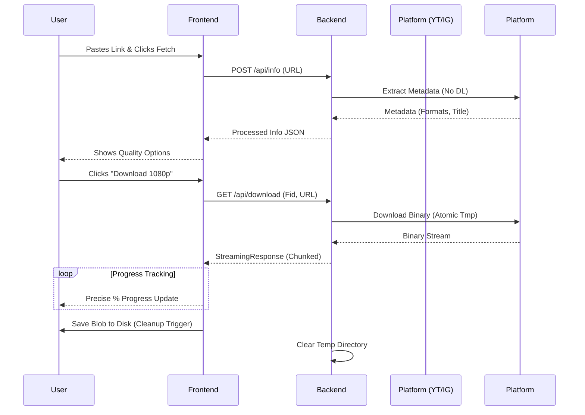

# KwikSave 🚀

KwikSave is a high-performance, open-source media download engine. It provides a seamless, professional-grade interface for extracting high-fidelity video and audio from global social platforms including YouTube, Instagram, X (Twitter), and Facebook.

---

## 🏗️ Technical Architecture

KwikSave uses a **Decoupled Asynchronous Streaming Architecture**. This ensures the UI remains responsive while the server handles heavy multi-gigabit media streams.

### 1. High-Performance Backend (FastAPI)

The backend is built with **FastAPI**, leveraging Python's `asyncio` for non-blocking I/O.

#### 🛠️ Core Dependency Stack:

- **FastAPI (v0.100+)**: Provides the asynchronous REST framework. Chosen for its native support for `StreamingResponse` and top-tier performance benchmarks.
- **yt-dlp**: A highly optimized fork of `youtube-dl`. We use it for its aggressive update cycle, ensuring we bypass platform changes and rate-limiting.
- **Uvicorn**: An ultra-fast ASGI implementation that manages the worker processes.
- **Pydantic**: Enforces strict Type Hinting and Data Validation for all incoming request payloads.

#### ⚙️ Internal Logic & Workflows:

- **Thread Pool Execution**: Since `yt-dlp` is primarily a synchronous library, we wrap info extraction and downloading in `loop.run_in_executor(None, ...)` to ensure the main event loop is never blocked.
- **Atomic Temporary Storage**: For every download request, a unique `tempfile.mkdtemp()` is created. This prevents filename collisions and ensures localized cleanup.
- **Smart Formatting Engine**: The backend doesn't just return raw yt-dlp data; it processes metadata and categorizes it into user-friendly Quality Labels (e.g., "Ultra HD", "320kbps") and merges video-only streams with best-audio automatically using `ffmpeg` (where available on the host).

#### 📡 API Definitions:

| Endpoint        | Method | Purpose             | Key Mechanism                                                       |
| :-------------- | :----- | :------------------ | :------------------------------------------------------------------ |
| `/api/info`     | `POST` | Metadata Extraction | Returns title, view counts, and available format IDs.               |
| `/api/download` | `GET`  | Binary Streaming    | Pipes the file from the source to the user via a chunked generator. |
| `/api/health`   | `GET`  | Monitoring          | Simple heartbeat for load balancers.                                |

---

### 2. Modern Frontend (React + Geist)

The UI is a **SPA (Single Page Application)** focused on feedback-driven design.

#### 🌊 Real-Time Progress Engine:

Unlike standard browsers' "hidden" downloads, KwikSave uses a custom **ReadableStream Reader** implementation in `utils.js`.

1. It initiates a `fetch()` request to the backend.
2. It captures the `response.body.getReader()`.
3. It monitors the `content-length` header to calculate a precise **0-100% progress** value as chunks arrive.
4. Chunks are pushed into an array and finally converted to a **Blob** for a localized "Save As" trigger.

#### 🎨 Design System:

- **Geist UI Integration**: A minimalist, high-contrast theme focused on typography and spacing.
- **Theme Engine**: Uses CSS Custom Properties (`--primary`, `--background`) mapped inside an `@theme` block in `index.css`.
- **Glassmorphism**: Backdrop blurs (`backdrop-filter`) and localized shimmers for premium finish.

---

## 🔄 Sequence Diagram: The Download Flow



---

## 🛡️ Security & Privacy Deep-Dive

- **Input Sanitization**: Our `validate_url` helper uses a whitelist of `SUPPORTED_DOMAINS` and a strict Regex `[;|` ` $]` to block shell injection attempts.
- **State Management**: The application is entirely **stateless**. No database is required. We don't track what you save, when you save it, or your IP address.
- **Cache Evacuation**: We use an in-memory dictionary for media info with a **5-minute TTL (Time-To-Live)**. This speeds up consecutive resolution requests while ensuring stale data is purged.

---

## 📂 Code Structure Overview

- **`kwiksave_backend.py`**: The "Grand Master" file containing all API routes, yt-dlp configurations, and security logic.
- **`src/utils.js`**: Home to the `fetchWithProgress` logic—the bridge between the browser's networking and our UI progress bars.
- **`src/index.css`**: The core style manifest defining Geist typography and the Shimmer/Spinner animations.
- **`src/components/`**: Focused, atomic React components (MediaCard, DownloadBox) that handle local UI states (Idle vs. Downloading).

---

## ⚡ Deployment Guide (Free Platforms)

The KwikSave backend can be deployed using Docker on several free platforms. Since the engine relies on `yt-dlp` and `ffmpeg`, Docker ensures all binary dependencies are correctly satisfied.

### 🛠️ Prerequisites
1.  **GitHub Repo**: Push your code (including `Dockerfile` and `requirements.txt`) to GitHub.
2.  **Docker Ready**: The repository already includes a production-ready `Dockerfile`.

### 1. Render (Recommended)
1.  Sign in to [render.com](https://render.com/).
2.  Create a **New Web Service** and connect your repo.
3.  Select **Docker** as the Runtime and the **Free** plan.
4.  Render builds and deploys automatically using the root `Dockerfile`.

### 2. Koyeb
1.  Sign in to [koyeb.com](https://koyeb.com/).
2.  Create a New App, select **GitHub** method, and choose your repo.
3.  Set the builder to **Docker** and ensure the port is set to `8000`.

### 3. HuggingFace Spaces
1.  Create a **New Space** on [huggingface.co](https://huggingface.co/).
2.  Choose the **Docker** SDK and the **Blank** template.
3.  Sync your GitHub repository or push directly to the Space's Git.

### 🛡️ Critical Post-Deployment Settings
- **CORS**: Update `kwiksave_backend.py` to allow your specific frontend domain.
- **Frontend URL**: Update your frontend's API base URL to point to the new backend address.
- **Port**: Ensure the platform maps requests to port `8000`.

---

## 🧪 Quick Local Start

1. **Backend**:
   ```bash
   pip install -r requirements.txt
   python kwiksave_backend.py
   ```
2. **Frontend**:
   ```bash
   npm install && npm start
   ```

