# KwikSave 🚀

KwikSave is a high-performance, open-source media download engine. It provides a seamless, professional-grade interface for extracting high-fidelity video and audio from global social platforms including Instagram, X (Twitter), TikTok, and Facebook.

---

## 🏗️ Technical Architecture

KwikSave follows a **Decoupled Asynchronous Streaming Architecture**, ensuring the UI remains highly responsive even during intensive multi-gigabit media operations.

### 1. High-Performance Backend (FastAPI)

The backend is built with **FastAPI**, leveraging Python's `asyncio` for non-blocking I/O and efficient worker management.

#### 🛠️ Core Dependency Stack:
- **FastAPI**: Provides the asynchronous REST framework. Chosen for native `StreamingResponse` support.
- **yt-dlp**: A highly optimized fork of `youtube-dl` with aggressive platform bypass capabilities.
- **Uvicorn**: Ultra-fast ASGI server for managing worker processes.
- **Pydantic**: Enforces strict Data Validation for all API payloads.

#### ⚙️ Internal Logic & Workflows:
- **Thread-Pool Offloading**: `yt-dlp` operations are wrapped in `loop.run_in_executor` to prevent blocking the main event loop.
- **Atomic File Management**: Every download request uses a unique `tempfile.mkdtemp()`, isolating media streams and ensuring atomic cleanup.
- **Server-Sent Events (SSE)**: Real-time progress (speed, ETA, status) is pushed to the client via `/api/progress/{id}`.
- **Thumbnail Proxying**: Bypasses platform-level hotlinking protections (e.g., Instagram) by proxying binary image data through our engine.
- **Automated Merging**: High-resolution video-only streams are automatically merged with the best available audio using `ffmpeg`.

#### 📡 API Definitions:

| Endpoint | Method | Purpose | Key Mechanism |
| :--- | :--- | :--- | :--- |
| `/api/info` | `POST` | Metadata Extraction | Returns formats, titles, and playlist entries. |
| `/api/download` | `GET` | Binary Streaming | Pipes the file from the source to the user via a chunked generator. |
| `/api/progress/{id}`| `GET` | SSE Progress | Streams server-side download status (Speed, ETA, %). |
| `/api/proxy/thumbnail`| `GET` | Proxy Image | Bypasses CSP/Hotlink blocks for media previews. |

---

### 2. Modern Frontend (React + Framer Motion)

The UI is a **SPA (Single Page Application)** focused on premium aesthetics and feedback-driven interactions.

#### 🌊 Hybrid Progress Engine:
KwikSave implements a dual-stage progress tracker:
1.  **Server Stage**: Monitors the backend's download from the platform (IG/X) to our disk via SSE.
2.  **Browser Stage**: Monitors the transfer from our server to the user's hard drive using `ReadableStream` readers.

#### 🎨 Design Philosophy:
- **Dark-First Aesthetic**: Now defaults to a premium, high-contrast dark theme.
- **Glassmorphism**: Leverages `backdrop-filter` and `oklch()` color spaces for deep, vibrant blurs.
- **Micro-Animations**: Framer Motion handles spring-based transitions for layout changes and button states.

---

## 🔄 Sequence Diagram: The Lifecycle of a Download

```mermaid
sequenceDiagram
    participant User
    participant Frontend
    participant Backend
    participant Platform (IG/X/TikTok)

    User->>Frontend: Pastes Link & Clicks Fetch
    Frontend->>Backend: POST /api/info (URL)
    Backend->>Platform: Extract Metadata (No DL)
    Platform-->>Backend: Metadata (Formats, Playlists)
    Backend-->>Frontend: Processed Info JSON
    Frontend-->>User: Renders MediaCard

    User->>Frontend: Clicks "Download 1080p"
    Frontend->>Backend: Establish SSE /api/progress/id
    Frontend->>Backend: GET /api/download (Fid, URL, ID)
    
    rect rgb(30, 30, 40)
    Note over Backend,Platform: Server Stage (DL to Disk)
    Backend->>Platform: Stream Binary to Atomic Tmp
    Backend-->>Frontend: SSE Pulse (Speed, %, ETA)
    end

    rect rgb(40, 30, 30)
    Note over Backend,Frontend: Browser Stage (Streaming)
    Backend-->>Frontend: StreamingResponse (Chunked)
    Frontend-->>User: UI Progress Update (Reader)
    end
    
    Frontend->>User: Trigger "Save As" (Blob)
    Backend->>Backend: Flush Temp Directory
```



---

## 🛡️ Security & Privacy

- **Stateless Operation**: No database. We don't log URLs, IP addresses, or downloaded content.
- **Input Sanitization**: Whitelisted domain matching and strict Regex guards against shell injection.
- **In-Memory Caching**: Media metadata is cached for 5 minutes (TTL) to speed up repeated requests without persisting data to disk.
- **Bot Defense Bypass**: Supports `YDL_COOKIES` environment variable to rotate credentials and bypass platform rate-limits.

---

## ⚡ Deployment Guide

The engine requires `yt-dlp` and `ffmpeg` binaries. Docker is the recommended deployment method.

### 🏠 Local Development
1.  **Backend**:
    ```bash
    pip install -r requirements.txt
    uvicorn kwiksave_backend:app --reload --port 8000
    ```
2.  **Frontend**:
    ```bash
    npm install && npm start
    ```

### ☁️ Production (Docker)
KwikSave is optimized for **Render**, **Koyeb**, and **HuggingFace Spaces**.
1.  Set `REACT_APP_BACKEND_URL` in your frontend environment.
2.  Ensure your backend container has `YDL_COOKIES` (optional) for enhanced platform access.
3.  Port: Internal `8000` is mapped for the API.

---

## 📂 Repository Roadmap
- [x] **Dark Mode Default**: Premium UI by default.
- [x] **SSE Integration**: Precise server-side feedback.
- [x] **Proxy Engine**: High-fidelity thumbnail previews.
- [x] **Playlist Support**: Batch extraction from profile links.
- [ ] **Desktop Wrapper**: Electron-based distribution.
- [ ] **Browser Extension**: One-click download from IG/X.
